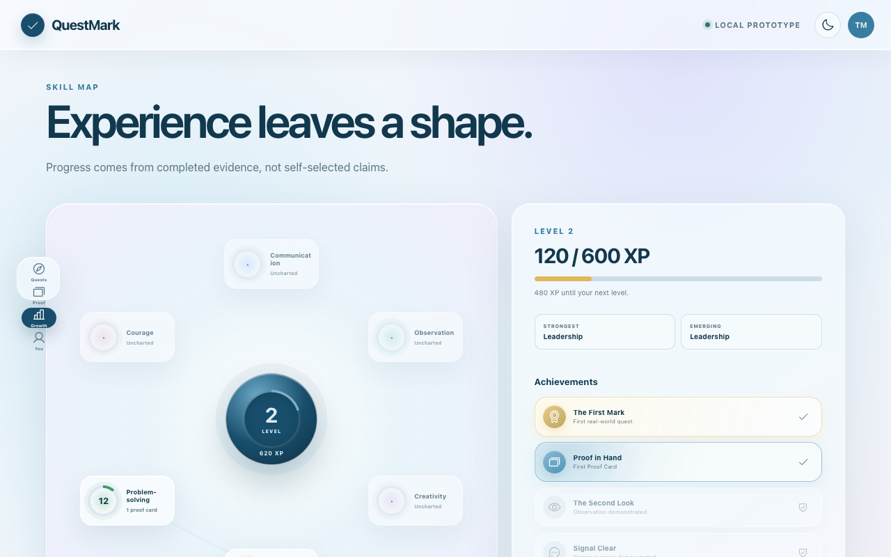
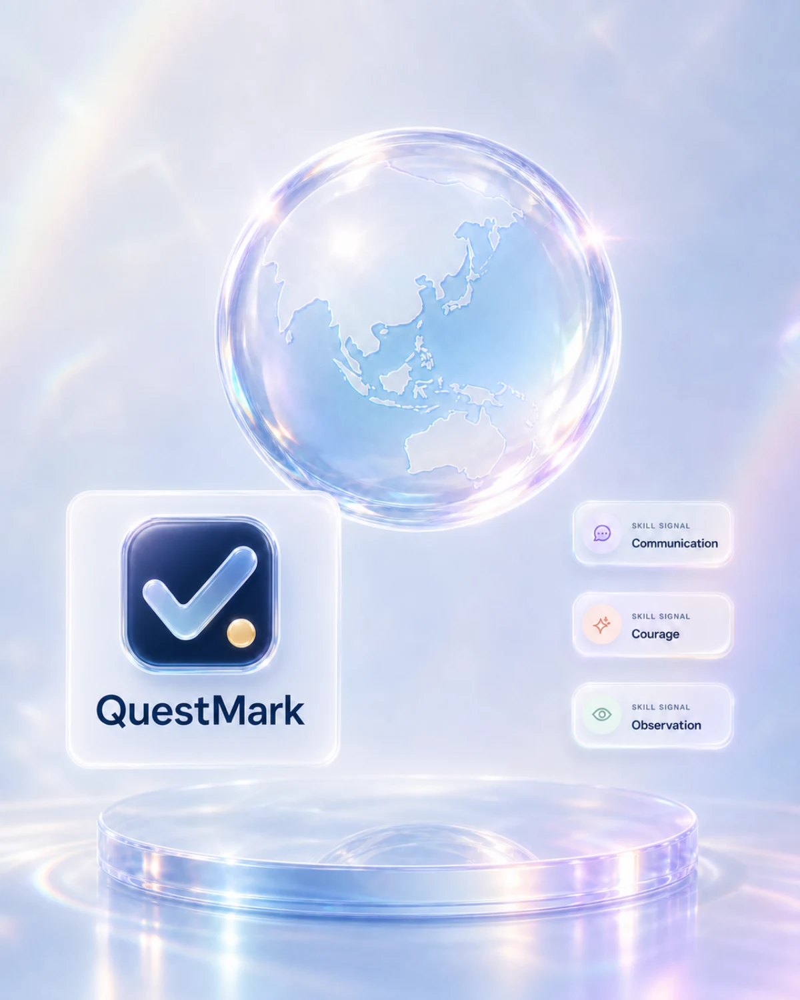

# QuestMark

**Proof beyond the screen.** QuestMark turns ordinary life into short, evidence-backed missions that help students discover what they can actually do.

[](https://ted0103.github.io/questmark/)

[Open the installable app](https://ted0103.github.io/questmark/) · [20-second walkthrough](./docs/questmark-demo.webm) · [Product plan](./PLAN.md)

## The idea

Most personal-development apps measure what happens on a screen. QuestMark sends people into the real world: interview a local founder, spot poor public design, teach a difficult concept, or improve a confusing message.

Each completed mission becomes a private Proof Card containing evidence, reflection, skills demonstrated, XP, and optional peer verification. Users decide which cards to share or feature in a portfolio.

## What the prototype demonstrates

- Daily quests ranked from a selected place or device location
- Photo, audio, note, and short-video evidence flows
- Animated Proof Cards and an interactive skill constellation
- XP, levels, streaks, achievements, and pass-with-penalty choices
- Private-by-default evidence with explicit portfolio sharing
- Desktop and mobile layouts with reduced-motion support
- A one-click reset for a clean portfolio presentation



## Recommendation logic

The demo recognises several Kuala Lumpur areas, calculates straight-line distance with the Haversine formula, and ranks its small local quest set on-device. Browser coordinates are never uploaded by the demo.

This is intentionally labelled as a prototype: walking/transit times are estimates, the quest catalogue is limited, and AI assessment, authentication, media storage, and production route data still require backend services.

The GitHub Pages release is public and installable through your browser. Progress and evidence stay on this device; there is no account or cloud sync.



## Stack

Next.js 16, React 19, TypeScript, CSS, Supabase-ready schema, Playwright, and browser-native media/location APIs.

## Run locally

```bash
npm install
npm run dev
```

Open `http://localhost:3000`. Without environment variables, QuestMark runs at the root path with device-local storage and no service worker.

## Canonical source and state

- Product shell and interaction flow: `src/app/questmark-app.tsx`
- Design tokens, component styling, motion, and breakpoints: `src/app/globals.css`
- Optional backend schema: `supabase/migrations/20260727073720_questmark_core.sql`
- Demo persistence: browser `localStorage`; the reset action clears only QuestMark demo data.

Keep the local fallback working when adding backend features. Location ranking stays
on-device, evidence remains private by default, and every modal must trap keyboard
focus, close with Escape, and restore focus to its trigger.

## Quality checks

```bash
npm test
npm run lint
npm run build
npm run test:e2e
```

The interaction suite covers quest launch, keyboard focus, location reranking, demo reset, and desktop/mobile Chromium.

## Optional Supabase pilot

Create a free Supabase project, add the environment values described in `.env.example`, and apply `supabase/migrations/20260727073720_questmark_core.sql`. Row-level security protects exposed tables; never expose `SUPABASE_SECRET_KEY`.

Product decisions and safety boundaries are documented in [`PLAN.md`](./PLAN.md).

## Deployment

GitHub Actions exports the app with the `/questmark` base path, verifies the exported PWA offline, and deploys `out/` to GitHub Pages.
